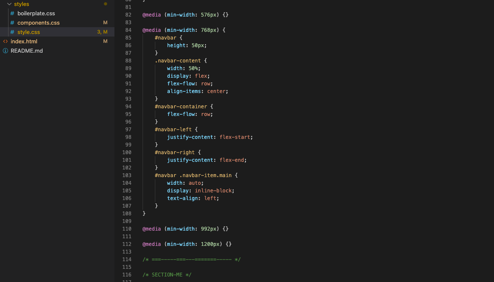
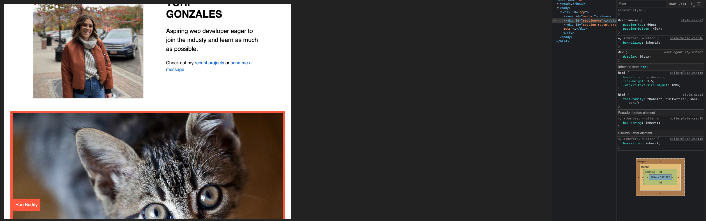
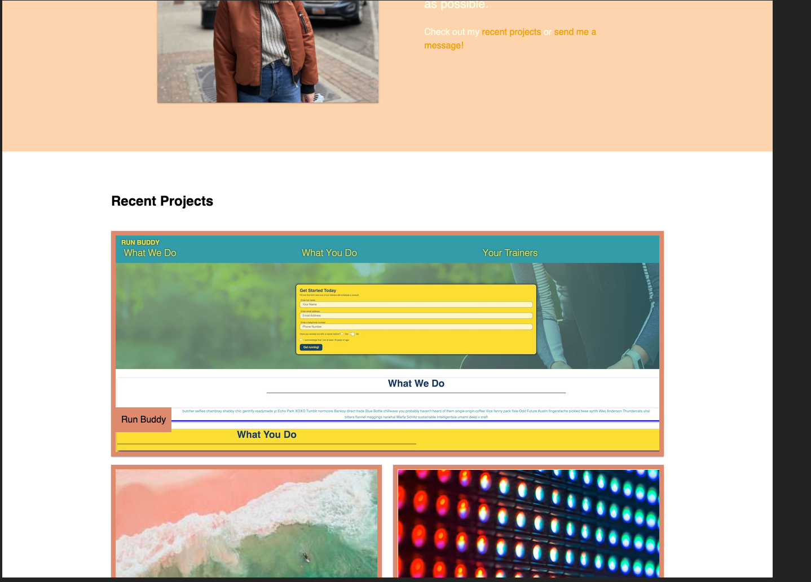
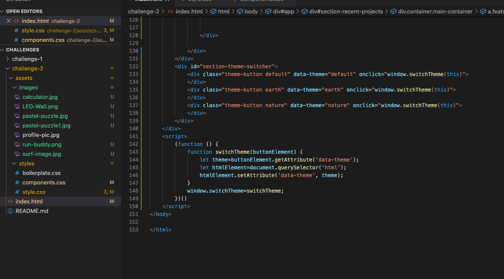

# Challenge 2- Digital Portfolio 
> About Me!
---
### Table of Contents
- [Description](#description)
- [Introduction](#introduction)
- [Challenges](#challenges)
- [Victories](#victories)
- [Resources](#resources)

---

## Description

Challenge #2- Building a digital portfolio! 

## Introduction 

In this challenge we were required to create our own code to build a digital portfolio. There were many challenges and also many victories. I loved getting to be creative and putting some of the knowledge i've gained to the test! 

---

## Challenges

Creating my own code was very eye-openiong and challenging. It was fun being able to get in the groove of organizing it in a way that others could read it easily. 

I began by creating media queries to set up the mobile version of my digital profile:

I laid out the page using example pictures to see how they would appear in the large container:

---

## VIctories

Adding style to my profile was awesome! It was exciting to add some flair! 

I also wanted to play with JavaScript a little and added button at the bottom at the page that changed the theme when they are clicked!

---

## Resources 

<a href="https://github.com/torigonzales/challenge1">GitHub Repo</a>

<a href="https://www.youtube.com/watch?v=eVGEea7adDM"> YouTube</a>

<a href="https://www.google.com/webhp?hl=en&sa=X&ved=0ahUKEwiLjJ7fosLvAhWXW80KHawRD_oQPAgI">Google</a>

